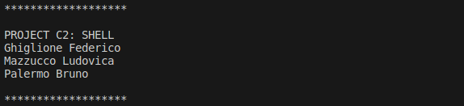

# System and Device Programming C2: Shell

| Student Name | Student ID | Contact |
| --- | --- | --- |
| Federico Ghiglione | 310052 | s310052@studenti.polito.it |
| Ludovica Mazzucco | 315093 | s315093@studenti.polito.it |
| Bruno Palermo | 309164 | s309164@studenti.polito.it |

### Teacher : **Cabodi Gianpiero**

### Academic Year: 2022-23

**Last Revision: 18 July 2023**

 

---

**Introduction**

The purpose of this project report is to describe the activities performed for this assignment.
In particular, the goal is to improve the functionality of OS161 by allowing multiple programs to run concurrently, each in its own process. This will be achieved using the execv and dup2 system calls, which will enable the execution of new programs and the duplication of the file descriptors related to a process.

The following are the implemented system call with the related error handles:

- open, read, write, lseek, close, dup2, chdir, getcwd
- getpid
- fork, execv, waitpid, _exit

**Team organization**

The project workflow revolves around utilizing the **GitHub** working environment. The project was divided into three main phases: Design & Coding, Testing, and Report Definition.

In the **Design & Coding** phase, Federico Ghiglione took the lead and designed and coded the skeleton implementation of the required system calls.

The **Testing** phase involved the collaboration of Ludovica Mazzucco and Bruno Palermo. They conducted extensive testing and seamlessly integrated each system call into the os161, ensuring smooth functionality. They utilized the bin/sh shell, which was already defined in the system.

Finally, for the sake of efficiency, Bruno Palermo took charge of completing the **Report definition**, which described each aspect of the code implementation. Simultaneously, Ludovica Mazzucco focused on the debugging phase, ensuring the code was free from errors, as well as implementing last functionalities such as the link between children and parent processes once the latter exits.

This division of work allowed an efficient and organized execution of the project, with each team member contributing their expertise to different aspects of the project.

**System call description**

---

File system call

**Open**

```c
int
sys_open(userptr_t path, int openflags, mode_t mode, int *errp)
{
    int fd, i;
    struct vnode *v;
    struct openfile *of=NULL;
    int result;
    userptr_t path_temp= path;

    //open file
    result = vfs_open((char *)path_temp, openflags, mode, &v);
    if (result) {
      *errp = result; //manual reference
      return -1;
      }

    //saving stats about file in file_stat
    struct stat file_stat;
    result = VOP_STAT(v, &file_stat);
    if(result){
      *errp = result; // manual refernce
      vfs_close(v);
      return -1;
    }

    //saving the length of the file in the related vnode
    off_t file_size = file_stat.st_size;
    v->vn_len = file_size; 

    /* search system open file table */
    for (i=0; i<SYSTEM_OPEN_MAX; i++) {
      if (systemFileTable[i].vn==NULL) {
        of = &systemFileTable[i];
        of->countref_lk=kmalloc(sizeof(struct spinlock));
        spinlock_init(of->countref_lk);
        of->vn = v;
        of->offset = 0; 
        if(openflags && O_APPEND != 0){
            //if I have the APPEND flag, update the offset
            of->offset = v->vn_len;
        }
        of->countRef = 1;
        break;
      }
    }
    if (of==NULL) { 
        // no free slot in system open file table
        *errp = ENFILE;
        vfs_close(v);
        return -1;
    }
    else {
        for (fd=STDERR_FILENO+1; fd<OPEN_MAX; fd++) {
            if (curproc->fileTable[fd] == NULL) {
                curproc->fileTable[fd] = of;
                return fd;
            }
        }
        
        
    }
    // no free slot in process open file table
    *errp = EMFILE;
    of->vn = NULL;
    spinlock_cleanup(of->countref_lk);
    kfree(of->countref_lk);
    vfs_close(v);
    return -1;
}
```

The function opens a file, stores its information, and assigns it a file descriptor in the process's file table if available. The function opens the specified file using **`vfs_open`**. If the file opening fails, it returns -1 and sets the appropriate error code. Information about the file, such as its size, is retrieved using **`VOP_STAT`**. The file size is stored in the file's vnode structure (vn_len) . 

The code searches for an available slot in the system's open file table and initializes the open file structure. If the file opening flags include **`O_APPEND`**, the file offset is updated to the end of the file. If no free slot is found in the system's open file table, an error code is set. If a free slot is available, the code searches for an available file descriptor in the process's file table. If a free file descriptor is found, the open file structure is assigned to it, and the file descriptor is returned. If no free file slots in system open file table then `ENFILE` (File Table Overflow) is assigned to the parameter errp otherwise if no free slot in process open file table then `EMFILE` (Too Many Open Files) is assigned to the former parameter.

Finally, the vnode is closed using **`vfs_close`**, and -1 is returned to indicate that failed since it would have returned in case fd was successfully assigned to a slot of the process file table.

**Read**

```c
int
sys_read(int fd, userptr_t buf_ptr, size_t size)
 {
  int i;

  //reading a file
  if (fd!=STDIN_FILENO) {
    return file_read(fd, buf_ptr, size);
  }

  //stdin
  char* temp_buf= kmalloc((size)*sizeof(char));
  if(temp_buf==NULL){
    return ENOMEM;
  }

  for (i=0; i<(int)size; i++) {
    temp_buf[i] = getch();
    if (temp_buf[i] < 0){
      int result= copyout(temp_buf,(userptr_t)buf_ptr,(size_t)i);
      return result;
    }
  }
  copyout(temp_buf,(userptr_t)buf_ptr,size);
  kfree(temp_buf);

  return (int)size;
}
```

The function reads in STDIN or any other file descriptor data into a buffer. In case the file descriptor is not STDIN then file_read is called otherwise it allocates a temporary buffer of the specified size on the parameter. If an error happen then it copies the byte read so far to the user buffer and returns the corresponding error code otherwise it copies the entire temp buffer into the user buffer. Finally it frees the temporary buffer and return the total number of read bytes.

In particular `file_read` refers to:

```c
static int
file_read(int fd, userptr_t buf_ptr, size_t size) {
    struct iovec iov;
    struct uio ku;
    int result, nread;
    struct vnode *vn;
    struct openfile *of;
    void *kbuf;

    if (fd<0||fd>OPEN_MAX)
        return EBADF; //manual reference

    of = curproc->fileTable[fd];
    if (of==NULL) 
        return EBADF;

    vn = of->vn;
    if (vn==NULL)
        return EBADF;

    off_t remaining = vn->vn_len - of->offset;//remaining length of the file
    size_t bytes_to_read = (size < (size_t)remaining) ? size : (size_t)remaining;
    //bytes_to_read is the lower between remaining and size

    kbuf = kmalloc(bytes_to_read);
    uio_kinit(&iov, &ku, kbuf, bytes_to_read, of->offset, UIO_READ);
    result = VOP_READ(vn, &ku);
    if (result) {
        return result;
    }
    of->offset = ku.uio_offset;
    nread = bytes_to_read - ku.uio_resid;
    copyout(kbuf,buf_ptr,nread);
    kfree(kbuf);
    return (nread);
}
```

The function reads data from a file specified by the file descriptor, copies it to a user buffer, and returns the number of bytes read.

It performs checks on the the file descriptor parameter validity, the openfile existance and the associated vnode , allocates and copies data to a kernel buffer, performs the read operation, updates the offset, and copies the data to the user buffer. Finally, it frees the kbuf previously allocated and returns the nread which represents the value  of  read bytes.

**Write**

```c
int
sys_write(int fd, userptr_t buf_ptr, size_t size)
{
    int i;
    int result;
    //write into a file
    if (fd!=STDOUT_FILENO && fd!=STDERR_FILENO) {
        return file_write(fd, buf_ptr, size);
    }

    
    //write to stdout ot stderr
    char* temp_buf= kmalloc((size+1)*sizeof(char));
    if(temp_buf==NULL){
    return ENOMEM;
    }
    result = copyin((userptr_t)buf_ptr, temp_buf, size+1);
    if(result != 0){
        kfree(temp_buf);
        return result; //invalid address space for buf
    }
    for (i=0; i<(int)size; i++) {
        putch(temp_buf[i]);
        }
    kfree(temp_buf);
    return (int)size;
}
```

The function writes data to either a file specified by the file descriptor or the standard output/error. It performs memory allocation, data copying, and character-by-character writing.

In particular, `file_write` refers to:

```c
static int
file_write(int fd, userptr_t buf_ptr, size_t size) {
    struct iovec iov;
    struct uio ku;
    int result, nwrite;
    struct vnode *vn;
    struct openfile *of;
    void *kbuf;
    int result;
    if (fd<0||fd>OPEN_MAX)
        return EBADF;
  
    of = curproc->fileTable[fd];
    if (of==NULL)
        return EBADF;
    
    vn = of->vn;
    if (vn==NULL)   
        return EBADF;

    off_t remaining = vn->vn_len - of->offset;//remaining length of the file
    size_t bytes_to_write = (size < (size_t)remaining) ? size : (size_t)remaining;
    //bytes_to_write is the lower between remaining and size
  

    kbuf = kmalloc(bytes_to_write);
    if(kbuf == NULL) return ENOMEM;
    result = copyin(buf_ptr,kbuf,bytes_to_write);
    if(result != 0){
        kfree(kbuf);
        return result;
    }
    uio_kinit(&iov, &ku, kbuf, bytes_to_write, of->offset, UIO_WRITE);
    result = VOP_WRITE(vn, &ku);
    if (result) {
        kfree(kbuf);
        return result;
    }

    kfree(kbuf);
    of->offset = ku.uio_offset;
    nwrite = bytes_to_write - ku.uio_resid;
    if(ku.uio_resid != 0)return ENOSPC; //no space left on file system

    return (nwrite);
}
```

The function writes data from a user buffer to a file specified by the file descriptor. It performs various checks, allocates and copies data to a kernel buffer, performs the write operation, updates the offset, and returns the number of bytes written.

**Lseek**

```c
off_t sys_lseek(int fd, off_t pos, int whence){

    if(fd<0 || fd>= OPEN_MAX || curproc->fileTable[fd] == NULL){
        return EBADF; //invalid file descriptor
    }

    switch(whence){
        case SEEK_SET:
            curproc->fileTable[fd]->offset = pos;
            break;
        case SEEK_CUR:
            curproc->fileTable[fd]->offset +=pos;
            break;
        case SEEK_END:
            curproc->fileTable[fd]->offset = curproc->fileTable[fd]->vn->vn_len+pos;
            break;
        default:
            return EINVAL; //invalid whence value
    }
    if(curproc->fileTable[fd]->offset <0 ){
        return EINVAL; //result of seek position negative
    }

    return curproc->fileTable[fd]->offset;
}
```

The function performs a seek operation on a file represented by the file descriptor. 

It validates the file descriptor, updates the file's offset based on the seek origin, and returns the new offset value. It handles the seek origins: set, current, and end. In case invalid whence it returns `EINVAL` error code.

**Close**

```c
int
sys_close(int fd){

    struct openfile *of=NULL; 
    struct vnode *vn;

    if (fd<0||fd>OPEN_MAX)
        return EBADF; // manual reference invalid file descriptor

    of = curproc->fileTable[fd];

    if (of==NULL)
        return EBADF; //Manual reference invalid file descriptor

    //remove from curproc fileTable
    curproc->fileTable[fd] = NULL; 
  

    if (--of->countRef > 0) 
        return 0; // just decrement ref cnt
    vn = of->vn;
    if (vn==NULL) return EBADF; //invalid vnode
    of->vn = NULL;
    spinlock_cleanup(of->countref_lk);
    kfree(of->countref_lk);
    vfs_close(vn);
    return 0;
}
```

The function closes a file descriptor by removing the reference to the corresponding **`openfile`** structure.

To do so it decrements the reference count, and releasing associated lock of the counter freeing it and the vnode in case it was the last reference to the opened file .

It performs error checks whether the parameter is valid, the referred openFile actually exists in the fileTable and the vnode is actually defined.

**Dup2**

```c
int sys_dup2(int oldfd, int newfd){

    //check validity of the two file descriptors
    if(oldfd < 0 || oldfd >= __OPEN_MAX || curproc->fileTable[oldfd] == NULL){
        return EBADF;
    }
    if(newfd == oldfd)
        return oldfd; //same fd 
    if(newfd < 0 || newfd >= __OPEN_MAX ){
        return EBADF;
    }

    //if newfd already used, close corresponding file first
    if(curproc->fileTable[newfd]!=NULL){
        sys_close(newfd);
    }

    //perform the dup2 
    int err = fdtable_dup(oldfd,newfd);
    if(err){
        return err;
    }
    return newfd;
    
}
```

The `dup2` system call is used to duplicate a file descriptor (oldfd) to a specified new file descriptor (newfd). 

It first checks the validity of the two file descriptors: oldfd and newfd. If either of them is invalid, it returns the appropriate error code (EBADF). If newfd is the same as oldfd, it returns oldfd as there is no need to duplicate the file descriptor in this case. If newfd is already in use, it closes the file corresponding to newfd using the sys_close system call. It then calls the fdtable_dup function to perform the actual duplication of the file descriptor. 

If an error occurs during the duplication, it returns the error code. If the duplication is successful, it returns the new file descriptor (newfd).

In particular, `fdtable_dup` refers to:

```c
int fdtable_dup(int oldfd, int newfd){
  
    struct openfile * old_file;
 
    KASSERT(oldfd >= 0 && oldfd <__OPEN_MAX);
    KASSERT(newfd >= 0 && newfd <__OPEN_MAX);

    old_file = curproc->fileTable[oldfd];

    if(old_file == NULL){
        return EBADF;
    }

    curproc->fileTable[newfd]=old_file;
    openfileIncrRefCount(old_file);

    return 0;
    
}
```

This function duplicates a file descriptor from **`oldfd`** to **`newfd`** in the file table, incrementing the reference count of the file. It performs error checking whether the retrieved old_file doesn’t exists returing `EBADF`(Bad file descriptor) otherwise just 0 indicating that the operation was successful. 

**Chdir**

```c
int sys_chdir(userptr_t path){

    if(path == NULL){
        return EFAULT;
    }

    char * kbuf;
    int result;

    //allocate kernel buffer
    kbuf = kmalloc(PATH_MAX);
    if(kbuf == NULL){
        return ENOMEM;
    }

    //copy the pathname from user space to kernel buffer
    result = copyinstr(path,kbuf,PATH_MAX,NULL);
    if(result){
        kfree(kbuf);
        return result;
    }

    //open the directory
    struct vnode *newcwd;
    result = vfs_open(kbuf,O_RDONLY,0,&newcwd);
    if(result){
        kfree(kbuf);
        return result;
    }

    struct vnode * oldcwd = curproc->p_cwd;
    curproc->p_cwd = newcwd;
    vfs_close(oldcwd);

    kfree(kbuf);
    return 0;

}
```

The function changes the current working directory to the path specified by the **`path`** parameter.

 It performs error checks validating the presence of the parameter(`EFAULT`), allocates a kernel buffer raising a `ENOMEM` error in case it could not allocate, copies the pathname from user space to kernel space rising an error code (result) in case the operation failed, opens the directory rising again an error code in case of operation failed, updates the current working directory of the process, and releases allocated resources. Finally it returns 0 in case of success.

**Getcwd**

```c
int sys_getcwd(userptr_t buf_ptr,size_t size){
    struct uio u;
    struct iovec iov;
    
    if(buf_ptr == NULL){
        return EFAULT;
    }

    int result;

    iov.iov_ubase = buf_ptr;
    iov.iov_len = size;

    u.uio_iov = &iov;
    u.uio_iovcnt = 1;
    u.uio_resid = size;  
    u.uio_offset = 0;
    u.uio_segflg =UIO_USERISPACE;
    u.uio_rw = UIO_READ;
    u.uio_space = curproc->p_addrspace;

    result = vfs_getcwd(&u);
    if(result){
        return result;
    }

    return size;
}
```

The function returns the process ID of the current process after verifying that the process exists.

---

Process system call

**Getpid**

```c
// getpid syscall

pid_t
sys_getpid(void){
    
    KASSERT(curproc != NULL);
    return curproc->p_pid;
}
```

**fork**

```c
int sys_fork(struct trapframe *ctf, pid_t *retval) {
    struct trapframe *tf_child;
    struct proc *newp;
    int result;

    KASSERT(curproc != NULL);
    if(curproc->p_numthreads > MAX_THREADS)
        return EMPROC;
    newp = proc_create_runprogram(curproc->p_name);
    if (newp == NULL) {
        return ENOMEM;
    }
#if PC_LINK
    // linking parent and child, so that child terminated on parent exit
    curproc->num_children++;

    struct proc* child;
    struct proc* p = curproc;

	for (int i=0; i<MAX_CHILDREN; i++){
		child= p->children[i];
		if(child==NULL) curproc->children[i]= newp;
	}
#endif
    /* done here as we need to duplicate the address space 
       of the current process */
    result = as_copy(curproc->p_addrspace, &(newp->p_addrspace));
    if(newp->p_addrspace == NULL){
        proc_destroy(newp); 
        return result; 
    }

    /* we need a copy of the parent's trapframe */
    tf_child = kmalloc(sizeof(struct trapframe));
    if(tf_child == NULL){
        proc_destroy(newp);
        return ENOMEM; 
    }
    memcpy(tf_child, ctf, sizeof(struct trapframe));

    result = thread_fork(
        curthread->t_name, newp,
		call_enter_forked_process, 
		(void *)tf_child, (unsigned long)0);

  if (result){
    proc_destroy(newp);
    kfree(tf_child);
    return ENOMEM;
  }

  *retval = newp->p_pid;

  return 0;
}
```

The **`sys_fork`** function duplicates the current process by creating a new process. It copies the address space and trapframe of the parent process, creates a new thread for the child process, and assigns the child's process ID to **`retval`**. It returns 0 if successful or an error code (**`ENOMEM`**) if any step fails.

In particular, `call_enter_forked_process` refers to:

```c
// auxiliary function called by fork

static void
call_enter_forked_process(void *tfv, unsigned long dummy) {
  struct trapframe *tf = (struct trapframe *)tfv;
  (void)dummy;
  enter_forked_process(tf); 
 
  panic("enter_forked_process returned (should not happen)\n");
}
```

the **`call_enter_forked_process`** function is a helper function used to execute the forked child process. It calls the **`enter_forked_process`** function with the trapframe pointer, and in case of an unexpected return from **`enter_forked_process`**, a panic function is triggered.

The function initialize an address space to be allocated for the new process.

The code section enclosed inside the constant `PC_LINK` will be further discussed in a specific subsequent paragraph and refers to the linking between parent and child processes once the former exits causing the latter to die as well. 

**execv**

```c
// execv syscall

int sys_execv( char * progname, char * args[]){

    struct addrspace *as;
    struct vnode *v;
    vaddr_t entrypoint,stackptr, ptr_argv;
    int result;

    int num_args = 0;
    while(args[num_args] != NULL){
        num_args++;
    }

    char **kargs = kmalloc((num_args+1)*sizeof(char *));
    if(kargs == NULL){
        return ENOMEM;
    }

    result = copyin_args(progname,args,num_args,kargs);
    

    if(result){
        kfree(kargs);
        return result;
    }
    curproc->p_name=kargs[0];

    //open the executable file
    result = vfs_open(kargs[0],O_RDONLY,0,&v);

    if(result){
        kfree(kargs);
        return result;
    }
    //create a new address space
    as = proc_getas();
    as_destroy(as);

    as = as_create();
    if(as == NULL){
        vfs_close(v);
        kfree(kargs);
        return ENOMEM;
    }

    //switch to the new address space
    proc_setas(as);
    as_activate(); 

    //load the executable

    result = load_elf(v,&entrypoint);
    if(result){
        vfs_close(v);
        kfree(kargs);
        return result;
    }

    //done with the file
    vfs_close(v);

    //define the user stack in the address space
    result = as_define_stack(as,&stackptr);
    if(result){
        kfree(kargs);
        return result;
    }

    //copy arguments to the user stack
    result = copyout_args(kargs,num_args,&stackptr, &ptr_argv);
    if(result){
        kfree(kargs);
        return result;
    }
    kfree(kargs);
    enter_new_process(num_args,(userptr_t)ptr_argv,NULL,stackptr,entrypoint);

    //enter_new_process does not return
    panic("enter new process returned\n");
    return EINVAL;
}
```

This system call allows a process to replace its image with the one of another executable whose name is passed as argument, it is usually called after a `fork()` . It first allocates a buffer to transfer the arguments strings from user to kernel space through the function `copyin_args(progname,args,num_args,kargs)` , hence it will contain either the name of the program to load and the vector that will be used as `argv` by the main. At this point the vnode corresponding to the program name is opened by `vfs_open(kargs[0],O_RDONLY,0,&v)` and it will be used by `load_elf(v,&entrypoint)` to load the executable once a new address space is set. Since the running process at the time of the call to execv has already sought physical frames and it has a proper address space, it needs to destroy it and create a new one with the proper virtual-physical mapping stated by the ELF file. After having defined the virtual address of the stack but before entering in usermode, execv needs to assure the forerunning program a proper parameter setting, which is performed through `copyout_args(kargs,num_args,&stackptr, &ptr_argv)`  

obeying the rules for a correct memory alignment.

**waitpid**

```c
// waitpid syscall

pid_t
sys_waitpid(pid_t pid, userptr_t statusp, int options)
{
    struct proc *p = proc_search_pid(pid);
    int s;
    if (p==NULL) 
        return -1;
    s = proc_wait(p,options);
    if (statusp!=NULL) 
        *(int*)statusp = s;
    return pid;
}
```

The function waits for a process with a given process ID to finish, retrieves its exit status, and assigns it to a user-provided pointer if available. Finally, it returns the process ID that was waited for. 

In particular, `proc_search_pid` refers to:

```c
struct proc *
proc_search_pid(pid_t pid) {
	struct proc *p;
	KASSERT(pid >= 0 && pid < MAX_PROC);
	p = processTable.proc[pid];
	KASSERT(p->p_pid == pid);
	return p;
}
```

The function retrieves the process pointer of a given pid by checking first the validity of the pid parameter and then, after retrieving the process pointer, checking if the pid parameter matches with the one of the pid related to the process. Finally it returns the process pointer.

The following is the description of what the `processTable` contains:

```c
#define MAX_PROC 100
static struct _processTable {
	int active;           /* initial value 0 */
	struct proc *proc[MAX_PROC+1]; /** [0] not used. pids are >= 1 **/
	int last_i;           /** index of last allocated pid **/
	struct spinlock lk;	/** Lock for this table */
} processTable;
```

It defines a process table **`processTable`** with an array of **`struct proc`** elements. It keeps of the validity of the processTable on bootstrap, maintains the last allocated process ID (`last_i`), and uses a spinlock(`lk`) for accessing the lock one at a time. 

The key function inside here is `proc_wait(p,options)` . In fact, it contains a call to the process semaphore ( `P(p->p_sem)` ) which is signaled once the waited process performs the exit system call.

**_exit**

```c
// _exit syscall

void
sys__exit(int status)
{
    struct proc *p = curproc;
#if PC_LINK
    // make all the children processes exit
    if(p->num_children!=0) kill_children(p);

    struct proc* parent= p->parent;
    if (parent != NULL){        // if parent==NULL then this is kernel process (see 'proc_create')
        struct proc* child;
        for(int i=0; i<MAX_CHILDREN; i++){
            child=parent->children[i];
            if (child && strcmp(child->p_name,curproc->p_name)==0){
                parent->children[i]=NULL;
                break;
            }
        }
        parent->num_children--;
    }
#endif
    p->p_status = status & 0xff; /* just lower 8 bits returned */
    proc_remthread(curthread);
#if USE_SEMAPHORE_FOR_WAITPID
    V(p->p_sem);
#else
    lock_acquire(p->p_lock);
    cv_signal(p->p_cv);
    lock_release(p->p_lock);
#endif
    thread_exit();

    panic("thread_exit returned (should not happen)\n");
}
```

The function handles the termination of the current process. It sets the process's exit status, removes the current thread from the process, signals the associated process semaphore allowing the parent process to proceed with its waitpid syscall (if any), and exits the current thread. Additionally, a panic function is included for any unexpected return from **`thread_exit()`**, though such a situation should never arise.

---

Implementing the link between parent and child processes

When a call to `sys_fork` is performed a child process is generated and duplicated by a parent one, the latter has the possibility to wait for its end through `sys_waitpid`, but if the parent is the one dying first as a consequence all its children have to end as well, hence the following code snippets help to cope with that.

The `struct proc` is modified adding new useful fields:

```c
#if PC_LINK
struct thread* p_threads[MAX_THREADS];
int num_children;
struct proc* children[MAX_CHILDREN];
struct proc* parent;
#endif
```

this allows the parent process to keep track about how many children it has generated with a reference to each of them. Moreover, the parent of the parent process is recorded in the case it exits first and needs to modify its parent’s “children” field. When it comes to the `sys__exit` call, the process has the duty to kill its children as well making use of the function *`kill_children(p).`*

```c
#if PC_LINK
/***  force all children to exit on parent process exit  ***/
void kill_children(struct proc* p){
struct proc* child;
for (int i=0; i<MAX_CHILDREN; i++){
	child= p->children[i];
	if(child) exit_process(child);
}

p->num_children=0;
}

#endif

```

In turn, it calls the function `exit_process(child)` which is a variation of the sysexit but taking a process as argument and not provoking the current process/thread to exit.

```c
#if PC_LINK
// variation of _exit used to kill children processes once the parent exits
void
exit_process(struct proc* p)
{
    // make all the children processes exit
    if(p->num_children==0) return;

    kill_children(p);

    struct thread* t;

    for(unsigned int i=0; i<MAX_THREADS; i++){
        t= p->p_threads[i];
        if( t && t->t_name!= curthread->t_name){
            proc_remthread(t);
            thread_destroy(p->p_threads[i]);
        }
    }
    
#if USE_SEMAPHORE_FOR_WAITPID
    V(p->p_sem);
#else
    lock_acquire(p->p_lock);
    cv_signal(p->p_cv);
    lock_release(p->p_lock);
#endif
    
}
#endif
```

In a nutshell, in this way a process which has generated children and performs the exit force those ones to exit as well.

## Testing using the shell



***True***


***False***


***Pwd***


***Cat***


***Cp***


***Exit***


